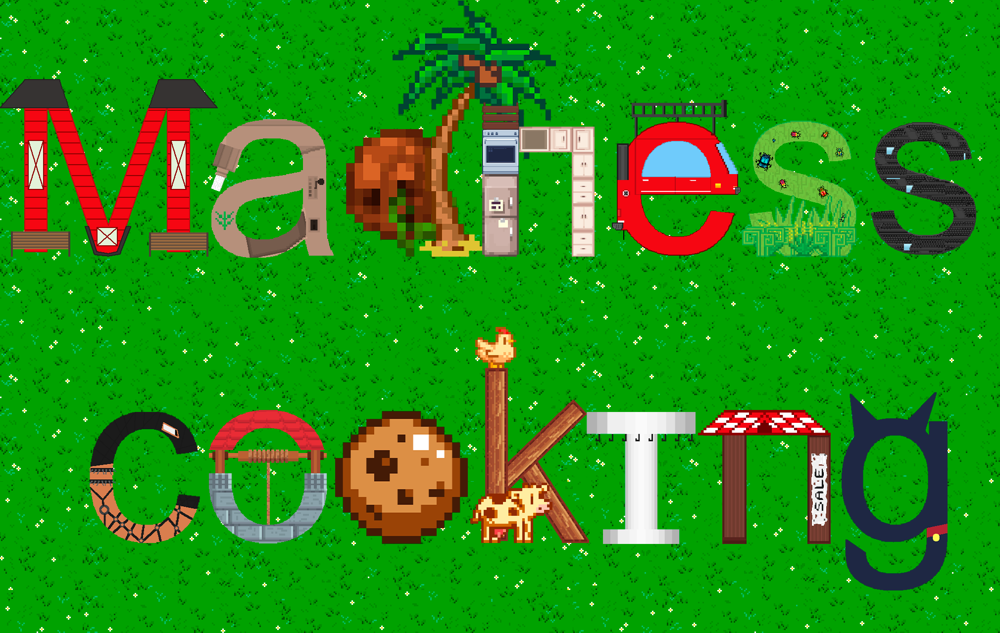

<p align="center"></p>

# Madness Cooking
Первая игра, созданная мною на движке Unity за лето 2021 года. Сюжета как такового не предусматривалось изначально, была лишь идея, заключающаяся в объединении двух 
жанров - симулятора кафе и симулятора фермы. На ранних стадиях идеи подразумевалось добавление к этим двум жанрам третьего - RPG, но от идеи было решено отказаться по 
причине нехватки скилла и времени. В итоге игра была созданна фактически за полтора месяца и я могу назвать её лишь пробой пера, не больше.

# Игра

Ссылка на страницу игры - https://nytrock.itch.io/madness-cooking
> Если вы столкнулись с каким либо багом, пожалуйста создайте [issue](https://github.com/Nytrock/Madness_Cooking_RU/issues).

Так же существуют [английская версия](https://github.com/Nytrock/Madness_Cooking_EN) 
и [версия для мобильных устройств](https://github.com/Nytrock/Madness_Cooking_Android).

# Основные игровые локации 

## Главное меню
Вряд ли можно назвать главное меню "локацией", но не написать о нём я не могу. При запуске игры вы попадаете именно сюда. При наличии сохранения вы сможете продолжить
на нём играть, иначе - начать новую игру. В настройках находится только регулировка звука и список используемых саундтреков. Кнопка выхода делает сами знаете что.

## Кафе
Первая локация, куда вы попадёте при первой игре. Здесь начинается обучение, показывающее все основные механики игры. Но сейчас не об этом. Так вот, у вас есть 
возможность открывать и закрывать кафе для посетителей, ускорять время для уменьшения времени ожидания посетителей. Ускорение кстати можно активировать в любой локации
игры, но работает оно только относительно посетителей. При появлении нового посетителя вы должны узнать его заказ и выполнить его за ограниченное время. При успешном
выполнении заказа вы получаете деньги, посетитель некоторое время ест принесённый заказ и только потом уходит.

## Кухня
Место, где находится список заказов от клиентов. При наличии нужных ингридиентов и оборудования блюдо можно приготовить, но готовиться оно будет некоторое время.
Также присутствует механика постепенной поломки оборудования, так что периодически его придётся чинить за внутриигровую валюту.

## Ферма
На ней вы будете выращивать все нужные ингридиенты для блюд. Есть стандартные грядки, на которых можно выращивать большую часть ингридиентов. Сами грядки можно удобрять
и поливать, тем самым увеличивая приносимый урожай. Постепенно на грядках будут появляться вредители и сорняки, от которых надо своевременно избавляться.
На более поздних этапах игры появится возможность улучшать грядки, например, можно навсегда защитить грядку от вредителей и сорняков, или же сделать грядку всегда
политой. Есть лавка, в которой продаются улучшения для фермы. Ещё в данной локации есть подлокация - амбар. В нём вы можете получить такие ингридиенты как молоко, яйца, муку, а также именно здесь вы можете переработать 
отходы в удобрения. Последнее, что не было упомянуто - автомобиль. В него будут складироваться все собранные продукты. В любой момент его можно будет отправить в город,
из-за чего все продукты в нём переместятся на кухню. Данное действие обладает кулдауном, так что его нужно использовать с умом.

## Офис
Последняя, но очень важная локация. Главное в ней - компьютер, через который можно покупать новые блюда, ингридиенты, технику для кухни, косметику для локаций 
и улучшения, по типу расширения кафе, ускорения работы техники и т.д.

# Запуск исходного кода на локальной машине
Если вы по какой-то причине захотели порыться в исходном коде или даже улучшить его, то данная инструкция для вас.

- Установить [Unity Hub](https://unity3d.com/ru/get-unity/download)
- Клонировать репозиторий

	```shell
	git clone https://github.com/Nytrock/Madness_Cooking_RU.git
	```
- Открыть Unity Hub, нажать на кнопку `Add project`, выбрать папку, в которую был склонирован репозиторий
- Нажать на созданный проект и начать изучать код
